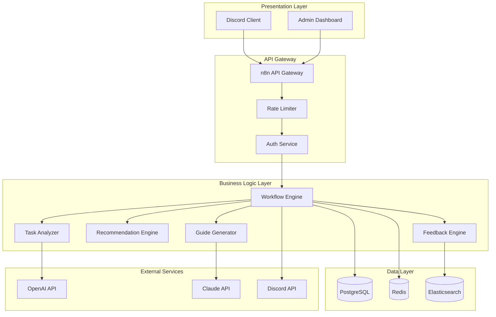
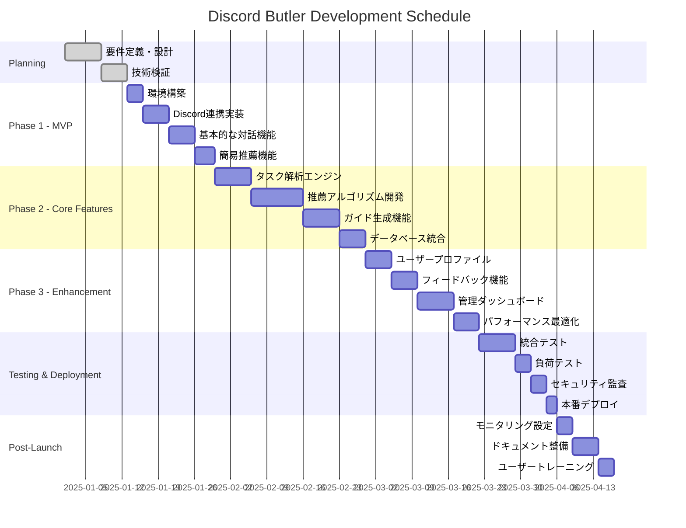
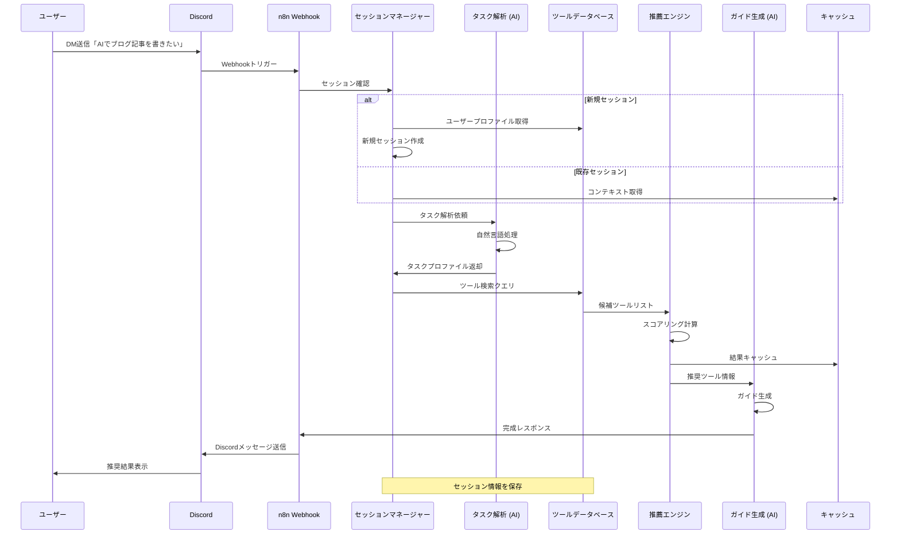
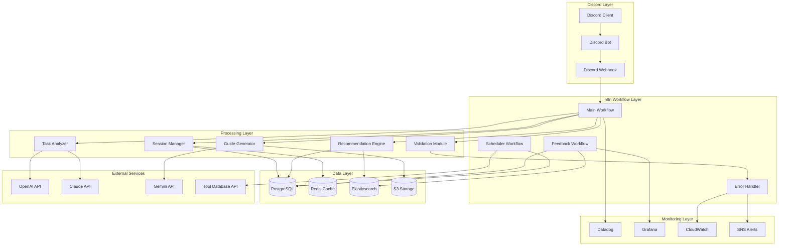

# Discord Butler システム要件定義書 v2.0

## エグゼクティブサマリー

Discord Butlerは、AI初心者向けに設計された自動化AIツール推薦システムです。ユーザーがDiscord DMを通じて作業内容を相談すると、最適なAIツールの選定から具体的な使用方法まで、包括的なガイダンスを提供します。本システムはn8nワークフロー基盤上に構築され、高い拡張性と保守性を実現します。

### 主要価値提案
- **アクセシビリティ**: Discord DMという親しみやすいインターフェースでAI活用の障壁を除去
- **パーソナライゼーション**: ユーザーのスキルレベルと目的に応じた最適なツール提案
- **実用性**: 抽象的な情報提供ではなく、即座に実行可能な具体的手順の提示
- **継続的学習**: フィードバックループによる推薦精度の向上

## 1. プロジェクト詳細

### 1.1 プロジェクト識別情報
- **プロジェクト名**: Discord Butler
- **プロジェクトコード**: DB-2024
- **バージョン**: 2.0
- **最終更新日**: 2025-07-05
- **ステークホルダー**: AI初心者ユーザー、システム管理者、開発チーム

### 1.2 プロジェクトスコープ

#### 1.2.1 含まれるもの
- Discord Bot経由のAIツール推薦機能
- ユーザープロファイル管理システム
- AIツールデータベースの構築・管理
- 使用方法生成エンジン
- フィードバック収集・分析機能
- n8nワークフローベースの実装
- 管理者向けダッシュボード

#### 1.2.2 含まれないもの
- AIツール自体の提供
- 有料ツールの代理購入
- AIツールのAPI統合（直接実行）
- ユーザー間のチャット機能
- モバイルアプリケーション

### 1.3 技術スタック詳細

```yaml
infrastructure:
  runtime: n8n v1.68+ (最新安定版、Node.js 20.19-24.x対応)
  database: PostgreSQL 15+ (プライマリ)
  cache: Redis 7.2+ (セッション管理)
  queue: BullMQ (次世代ジョブキュー)
  container: AWS Fargate (コンテナベースサーバーレス)
  
messaging:
  platform: Discord.js v14.16+
  protocol: WebSocket + REST API
  database: QuickDB (Discord特化型データストア)
  
ai_services:
  primary: OpenAI o3 API (エンタープライズ向け)
  secondary: Anthropic Claude 4 Opus (コーディング特化)
  fallback: Google Gemini 2.5 Pro (コスト効率重視)
  
n8n_features:
  - AI Workflow Evaluations (テスト・比較機能)
  - Community Nodes on Cloud
  - Partial Execution for AI Tools
  - Workflow Organization (フォルダ管理、2025 Q2予定)
  
monitoring:
  apm: Datadog / AWS X-Ray
  logging: OpenSearch (Elasticsearch互換)
  metrics: Prometheus + Grafana Cloud
  tracing: OpenTelemetry
  
security:
  secrets: AWS Secrets Manager / HashiCorp Vault
  auth: OAuth2 + JWT (Discord OAuth統合)
  encryption: AES-256-GCM
  api_protection: AWS WAF + CloudFront
```

## 2. 機能要件詳細

### 2.1 ユーザー向け機能

#### 2.1.1 会話型インターフェース (FR-UI-001)

**優先度**: 必須 (P1)

**詳細仕様**:
```typescript
interface ConversationInterface {
  // メッセージ受信
  receiveMessage(message: DiscordMessage): Promise<void>
  
  // コンテキスト管理
  contextManager: {
    sessionTimeout: 3600 // 秒
    maxContextLength: 10 // メッセージ数
    contextPersistence: true
  }
  
  // 応答生成
  generateResponse(context: ConversationContext): Promise<Response>
  
  // マルチターン対話
  supportedInteractionTypes: [
    'clarification', // 明確化質問
    'follow-up',     // フォローアップ
    'correction',    // 訂正
    'exploration'    // 探索的質問
  ]
}
```

**受け入れ基準**:
- 95%以上のメッセージが5秒以内に初期応答を返す
- コンテキストが最低10ターンまで保持される
- 自然言語での曖昧な入力を適切に処理できる

#### 2.1.2 作業内容解析エンジン (FR-AE-001)

**優先度**: 必須 (P1)

**解析アルゴリズム**:
```python
class TaskAnalyzer:
    def analyze(self, user_input: str) -> TaskProfile:
        return TaskProfile(
            domain=self._extract_domain(),          # 分野特定
            complexity=self._assess_complexity(),   # 複雑度評価
            required_skills=self._identify_skills(), # 必要スキル
            objectives=self._extract_objectives(),   # 目的抽出
            constraints=self._identify_constraints() # 制約条件
        )
```

**分類体系**:
- **ドメイン**: コンテンツ作成、データ分析、プログラミング、デザイン、研究、ビジネス
- **複雑度**: 初級（1-3）、中級（4-6）、上級（7-9）、エキスパート（10）
- **時間軸**: 即時（< 1時間）、短期（1日）、中期（1週間）、長期（1ヶ月以上）

#### 2.1.3 AIツール推薦アルゴリズム (FR-RE-001)

**優先度**: 必須 (P1)

**推薦ロジック**:
```javascript
const recommendationEngine = {
  // スコアリング関数（2025年最新基準）
  calculateScore: (tool, taskProfile, userProfile) => {
    const weights = {
      taskFit: 0.30,              // タスク適合性
      skillMatch: 0.20,           // スキルレベル一致度
      costEffectiveness: 0.25,    // コスト効率（重要度UP）
      performanceBenchmark: 0.15, // パフォーマンスベンチマーク
      languageSupport: 0.05,      // 言語サポート
      contextWindow: 0.05         // コンテキストウィンドウサイズ
    };
    
    // AI APIごとの特性を考慮
    const apiSpecificScores = {
      'claude-4-opus': { coding: 0.725, context: 1000000 },
      'openai-o3': { enterprise: 0.95, toolIntegration: 1.0 },
      'gemini-2.5-pro': { costEfficiency: 1.0, context: 2000000 }
    };
    
    return weightedSum(scores, weights, apiSpecificScores);
  },
  
  // フィルタリング条件
  filters: {
    mustHave: ['japanese_support', 'beginner_friendly'],
    exclude: ['deprecated', 'enterprise_only'],
    priceRange: { min: 0, max: userProfile.budget }
  }
};
```

**ツールデータベース構造**:
```sql
CREATE TABLE ai_tools (
    id UUID PRIMARY KEY,
    name VARCHAR(255) NOT NULL,
    category VARCHAR(100),
    capabilities JSONB,
    pricing_model JSONB,
    supported_languages TEXT[],
    skill_level INT CHECK (skill_level BETWEEN 1 AND 10),
    api_availability BOOLEAN,
    last_updated TIMESTAMP,
    metadata JSONB
);

CREATE INDEX idx_tools_category ON ai_tools(category);
CREATE INDEX idx_tools_capabilities ON ai_tools USING gin(capabilities);
```

#### 2.1.4 使用方法生成システム (FR-GU-001)

**優先度**: 必須 (P1)

**生成テンプレート構造**:
```yaml
guide_template:
  introduction:
    - tool_overview
    - key_benefits
    - prerequisites
  
  step_by_step:
    - account_setup:
        substeps: [registration, verification, initial_config]
    - basic_usage:
        substeps: [ui_navigation, first_task, result_interpretation]
    - advanced_features:
        conditional: user_skill_level > 5
  
  examples:
    - scenario_based: true
    - include_prompts: true
    - expected_outputs: true
  
  troubleshooting:
    - common_issues: dynamic_based_on_tool
    - faq: generated_from_feedback
  
  resources:
    - official_docs
    - community_links
    - video_tutorials
```

### 2.2 システム管理機能

#### 2.2.1 管理ダッシュボード (FR-AD-001)

**優先度**: 重要 (P2)

**機能仕様**:
- リアルタイムメトリクス表示
- ユーザー行動分析
- ツールデータベース管理UI
- システムヘルスモニタリング
- アラート設定・管理

#### 2.2.2 フィードバックループシステム (FR-FB-001)

**優先度**: 重要 (P2)

**実装詳細**:
```typescript
interface FeedbackSystem {
  // フィードバック収集
  collectFeedback(userId: string, sessionId: string): Promise<Feedback>
  
  // 分析エンジン
  analyzeFeedback(feedbacks: Feedback[]): InsightReport
  
  // 改善アクション
  generateImprovements(insights: InsightReport): ImprovementPlan
  
  // 自動適用
  applyImprovements(plan: ImprovementPlan, approval: boolean): Result
}
```

## 3. 非機能要件詳細

### 3.1 パフォーマンス要件 (NFR-PE-001)

#### 3.1.1 応答時間
- **P95レイテンシ**: < 3秒（テキスト生成含む）
- **P99レイテンシ**: < 5秒
- **初回応答時間**: < 1秒（処理中メッセージ）

#### 3.1.2 スループット
- **同時接続数**: 1,000ユーザー
- **メッセージ処理**: 100 req/秒
- **ピーク時対応**: 3x通常負荷

#### 3.1.3 リソース使用率
```yaml
resource_limits:
  cpu:
    average: "< 60%"
    peak: "< 80%"
  memory:
    average: "< 70%"
    peak: "< 85%"
  database_connections:
    pool_size: 100
    max_idle: 10
```

### 3.2 可用性要件 (NFR-AV-001)

#### 3.2.1 SLA定義
- **月間稼働率**: 99.9%（43.2分/月のダウンタイム許容）
- **計画メンテナンス**: 月1回、最大2時間（事前通知必須）
- **MTTR**: < 30分
- **MTBF**: > 720時間
- **マルチリージョン対応**: アクティブ-アクティブ構成

#### 3.2.2 障害対策
```yaml
fault_tolerance:
  circuit_breaker:
    threshold: 50% # エラー率
    timeout: 60s
    half_open_requests: 5
  
  retry_policy:
    max_attempts: 3
    backoff: exponential
    base_delay: 1s
    max_delay: 30s
  
  fallback_strategies:
    - graceful_degradation
    - cached_responses
    - alternative_ai_provider
    - multi_region_failover
  
  serverless_resilience:
    - aws_lambda_reserved_concurrency
    - fargate_auto_recovery
    - step_functions_error_handling
```

### 3.3 セキュリティ要件 (NFR-SE-001)

#### 3.3.1 認証・認可
```typescript
interface SecurityConfig {
  authentication: {
    method: 'OAuth2',
    provider: 'Discord',
    tokenExpiry: '24h',
    refreshTokenExpiry: '30d'
  },
  
  authorization: {
    model: 'RBAC',
    roles: ['user', 'premium_user', 'moderator', 'admin'],
    permissions: Map<Role, Permission[]>
  },
  
  encryption: {
    atRest: 'AES-256-GCM',
    inTransit: 'TLS 1.3',
    keyRotation: '90d'
  }
}
```

#### 3.3.2 データ保護
- **PII暗号化**: すべての個人識別情報
- **データ保持期間**: 90日（その後匿名化）
- **アクセスログ**: 1年間保持
- **GDPR準拠**: データエクスポート・削除機能

#### 3.3.3 脆弱性管理
```yaml
security_scanning:
  dependency_check:
    frequency: daily
    tool: Snyk/Dependabot
    discord_js_specific: true  # Discord.js v14特有の脆弱性チェック
  
  code_analysis:
    frequency: per_commit
    tools: [SonarQube, ESLint-security, CodeQL]
  
  penetration_testing:
    frequency: quarterly
    scope: [api, authentication, data_access, discord_oauth]
  
  secrets_management:
    - never_store_discord_token_in_code
    - use_environment_variables
    - implement_token_rotation
```

### 3.4 スケーラビリティ要件 (NFR-SC-001)

#### 3.4.1 水平スケーリング戦略
```yaml
scaling_config:
  auto_scaling:
    metrics:
      - cpu_utilization > 70%
      - memory_utilization > 75%
      - request_queue_depth > 100
    
    scale_out:
      min_instances: 2
      max_instances: 10
      cooldown: 300s
    
    scale_in:
      threshold: "< 30% utilization"
      cooldown: 600s
```

#### 3.4.2 データベーススケーリング
- **読み取りレプリカ**: 3台（地理的分散）
- **シャーディング**: ユーザーIDベース（将来実装）
- **キャッシュ戦略**: Redis クラスター

## 4. システムアーキテクチャ

### 4.1 論理アーキテクチャ



### 4.2 物理アーキテクチャ

```yaml
deployment_architecture:
  production:
    region: ap-northeast-1  # 東京リージョン
    dr_region: us-west-2    # DRリージョン
    
    compute:
      # サーバーレス優先アーキテクチャ
      fargate_tasks:
        cpu: 2048
        memory: 4096
        count: 3-10  # オートスケーリング
        
      lambda_functions:
        memory: 1024
        timeout: 900
        reserved_concurrency: 100
        
      n8n_instances:
        deployment: fargate
        cpu: 4096
        memory: 8192
        auto_scaling: true
    
    database:
      postgresql:
        instance: db.r6g.xlarge
        multi_az: true
        read_replicas: 2
      
      redis:
        instance: cache.r6g.large
        cluster_mode: true
        nodes: 3
    
    networking:
      vpc:
        cidr: 10.0.0.0/16
        availability_zones: 3
      
      load_balancer:
        type: application
        cross_zone: true
        
    storage:
      s3:
        buckets:
          - workflow-artifacts
          - user-data-backup
          - logs-archive
```

### 4.3 データモデル

```sql
-- ユーザープロファイル
CREATE TABLE user_profiles (
    user_id VARCHAR(255) PRIMARY KEY,
    discord_id VARCHAR(255) UNIQUE NOT NULL,
    skill_level INT DEFAULT 1,
    preferences JSONB DEFAULT '{}',
    created_at TIMESTAMP DEFAULT CURRENT_TIMESTAMP,
    updated_at TIMESTAMP DEFAULT CURRENT_TIMESTAMP,
    last_active TIMESTAMP,
    total_sessions INT DEFAULT 0,
    metadata JSONB DEFAULT '{}'
);

-- セッション管理
CREATE TABLE sessions (
    session_id UUID PRIMARY KEY DEFAULT gen_random_uuid(),
    user_id VARCHAR(255) REFERENCES user_profiles(user_id),
    started_at TIMESTAMP DEFAULT CURRENT_TIMESTAMP,
    ended_at TIMESTAMP,
    context JSONB DEFAULT '[]',
    task_profile JSONB,
    recommendations JSONB,
    feedback JSONB,
    status VARCHAR(50) DEFAULT 'active'
);

-- ツール使用履歴
CREATE TABLE tool_usage_history (
    id UUID PRIMARY KEY DEFAULT gen_random_uuid(),
    session_id UUID REFERENCES sessions(session_id),
    tool_id UUID REFERENCES ai_tools(id),
    recommended_at TIMESTAMP DEFAULT CURRENT_TIMESTAMP,
    user_action VARCHAR(50), -- 'selected', 'rejected', 'deferred'
    feedback_score INT CHECK (feedback_score BETWEEN 1 AND 5),
    feedback_text TEXT,
    outcome JSONB
);

-- インデックス定義
CREATE INDEX idx_sessions_user_id ON sessions(user_id);
CREATE INDEX idx_sessions_status ON sessions(status);
CREATE INDEX idx_tool_usage_session ON tool_usage_history(session_id);
CREATE INDEX idx_tool_usage_tool ON tool_usage_history(tool_id);
```

## 5. API仕様

### 5.1 RESTful API エンドポイント

```yaml
openapi: 3.0.0
info:
  title: Discord Butler API
  version: 2.0.0
  
paths:
  /api/v2/sessions:
    post:
      summary: 新規セッション作成
      requestBody:
        content:
          application/json:
            schema:
              type: object
              properties:
                user_id:
                  type: string
                initial_message:
                  type: string
      responses:
        201:
          description: セッション作成成功
          content:
            application/json:
              schema:
                $ref: '#/components/schemas/Session'
  
  /api/v2/sessions/{session_id}/messages:
    post:
      summary: メッセージ送信
      parameters:
        - name: session_id
          in: path
          required: true
          schema:
            type: string
      requestBody:
        content:
          application/json:
            schema:
              type: object
              properties:
                message:
                  type: string
                context:
                  type: object
      responses:
        200:
          description: 応答生成成功
          content:
            application/json:
              schema:
                $ref: '#/components/schemas/Response'
  
  /api/v2/tools/search:
    post:
      summary: ツール検索
      requestBody:
        content:
          application/json:
            schema:
              type: object
              properties:
                task_profile:
                  $ref: '#/components/schemas/TaskProfile'
                filters:
                  type: object
      responses:
        200:
          description: 検索結果
          content:
            application/json:
              schema:
                type: array
                items:
                  $ref: '#/components/schemas/Tool'
```

### 5.2 WebSocket イベント

```typescript
// WebSocket イベント定義
enum WebSocketEvents {
  // クライアント → サーバー
  MESSAGE_SEND = 'message:send',
  FEEDBACK_SUBMIT = 'feedback:submit',
  SESSION_END = 'session:end',
  
  // サーバー → クライアント
  MESSAGE_RECEIVE = 'message:receive',
  TYPING_START = 'typing:start',
  TYPING_STOP = 'typing:stop',
  RECOMMENDATION_UPDATE = 'recommendation:update',
  ERROR = 'error'
}

// イベントペイロード
interface MessagePayload {
  sessionId: string;
  content: string;
  attachments?: Attachment[];
  metadata?: Record<string, any>;
}
```

## 6. n8n ワークフロー詳細設計

### 6.1 メインワークフロー

```json
{
  "name": "Discord Butler - Main Workflow",
  "nodes": [
    {
      "parameters": {
        "events": ["MESSAGE_CREATE"],
        "filters": {
          "channel_type": "DM"
        }
      },
      "name": "Discord Trigger",
      "type": "n8n-nodes-discord.discordTrigger",
      "position": [250, 300]
    },
    {
      "parameters": {
        "functionCode": "// セッション管理ロジック\nconst userId = $input.first().json.author.id;\nconst message = $input.first().json.content;\n\n// 既存セッション確認\nconst session = await checkExistingSession(userId);\n\nif (!session) {\n  return createNewSession(userId, message);\n}\n\nreturn { sessionId: session.id, message, context: session.context };"
      },
      "name": "Session Manager",
      "type": "n8n-nodes-base.function",
      "position": [450, 300]
    },
    {
      "parameters": {
        "model": "gpt-4",
        "messages": {
          "systemMessage": "あなたはAIツール推薦の専門家です。ユーザーの作業内容を分析し、最適なツールを提案してください。",
          "userMessage": "={{$json.message}}",
          "context": "={{$json.context}}"
        },
        "options": {
          "temperature": 0.7,
          "maxTokens": 1000
        }
      },
      "name": "Task Analyzer",
      "type": "n8n-nodes-openai.openAi",
      "position": [650, 300],
      "typeVersion": 2.0  // AI Workflow Evaluations対応
    },
    {
      "parameters": {
        "operation": "select",
        "table": "ai_tools",
        "filters": {
          "category": "={{$json.task_profile.domain}}",
          "skill_level": {"lte": "={{$json.user_profile.skill_level + 2}}"}
        },
        "options": {
          "limit": 5,
          "orderBy": "relevance_score DESC"
        }
      },
      "name": "Tool Database Query",
      "type": "n8n-nodes-base.postgres",
      "position": [850, 300]
    },
    {
      "parameters": {
        "functionCode": "// 推薦スコアリング\nconst tools = $input.first().json;\nconst taskProfile = $node['Task Analyzer'].json.task_profile;\nconst userProfile = $node['Session Manager'].json.user_profile;\n\nconst scoredTools = tools.map(tool => ({\n  ...tool,\n  score: calculateRecommendationScore(tool, taskProfile, userProfile)\n}));\n\nreturn scoredTools.sort((a, b) => b.score - a.score).slice(0, 3);"
      },
      "name": "Recommendation Engine",
      "type": "n8n-nodes-base.function",
      "position": [1050, 300]
    },
    {
      "parameters": {
        "model": "claude-3-opus",
        "messages": {
          "systemMessage": "以下のAIツールについて、AI初心者向けに分かりやすい使用ガイドを生成してください。",
          "userMessage": "ツール: {{$json.tools}}\nタスク: {{$json.task_description}}"
        },
        "options": {
          "temperature": 0.3,
          "maxTokens": 2000
        }
      },
      "name": "Guide Generator",
      "type": "n8n-nodes-anthropic.claude",
      "position": [1250, 300],
      "typeVersion": 2.0,  // Partial Execution対応
      "settings": {
        "partialExecution": true,
        "testMode": true
      }
    },
    {
      "parameters": {
        "channelId": "={{$node['Discord Trigger'].json.channel.id}}",
        "message": {
          "content": "{{$json.guide}}",
          "embeds": [{
            "title": "おすすめAIツール",
            "fields": "={{$json.recommendations}}",
            "color": 5814783
          }]
        }
      },
      "name": "Discord Response",
      "type": "n8n-nodes-discord.discord",
      "position": [1450, 300]
    }
  ]
}
```

### 6.2 エラーハンドリングワークフロー

```json
{
  "name": "Error Handler Workflow",
  "nodes": [
    {
      "parameters": {
        "triggerOn": "workflowError",
        "filters": {
          "workflow": "Discord Butler - Main Workflow"
        }
      },
      "name": "Error Trigger",
      "type": "n8n-nodes-base.errorTrigger",
      "position": [250, 300]
    },
    {
      "parameters": {
        "functionCode": "// エラー分類と対処法決定\nconst error = $input.first().json;\nconst errorType = classifyError(error);\n\nswitch(errorType) {\n  case 'API_LIMIT':\n    return { action: 'retry', delay: 60000, fallback: 'use_alternative_api' };\n  case 'NETWORK_ERROR':\n    return { action: 'retry', delay: 5000, maxRetries: 3 };\n  case 'INVALID_INPUT':\n    return { action: 'user_notification', message: 'Invalid input format' };\n  default:\n    return { action: 'log_and_alert', severity: 'high' };\n}"
      },
      "name": "Error Classifier",
      "type": "n8n-nodes-base.function",
      "position": [450, 300]
    }
  ]
}
```

## 7. テスト戦略

### 7.1 テストレベルと範囲

#### 7.1.1 単体テスト
```javascript
// テストカバレッジ目標: 85%以上（2025年基準）
describe('TaskAnalyzer', () => {
  it('should correctly identify content creation tasks', async () => {
    const input = "ブログ記事を書きたい";
    const result = await taskAnalyzer.analyze(input);
    
    expect(result.domain).toBe('content_creation');
    expect(result.complexity).toBeLessThanOrEqual(5);
    expect(result.required_skills).toContain('writing');
  });
  
  it('should handle ambiguous inputs gracefully', async () => {
    const input = "何か作りたい";
    const result = await taskAnalyzer.analyze(input);
    
    expect(result.clarification_needed).toBe(true);
    expect(result.suggested_questions).toHaveLength(3);
  });
});
```

#### 7.1.2 統合テスト
```yaml
integration_tests:
  - name: "End-to-end Discord message flow"
    steps:
      - send_discord_message
      - verify_acknowledgment
      - check_task_analysis
      - validate_recommendations
      - confirm_guide_generation
    expected_time: "< 10s"
  
  - name: "Database integration"
    steps:
      - create_user_profile
      - start_session
      - save_recommendations
      - retrieve_history
    validations:
      - data_consistency
      - transaction_integrity
```

#### 7.1.3 負荷テスト
```javascript
// k6 負荷テストスクリプト
import http from 'k6/http';
import { check, sleep } from 'k6';

export const options = {
  stages: [
    { duration: '5m', target: 100 },  // ランプアップ
    { duration: '10m', target: 100 }, // 維持
    { duration: '5m', target: 200 },  // ストレステスト
    { duration: '5m', target: 0 },    // ランプダウン
  ],
  thresholds: {
    http_req_duration: ['p(95)<5000'], // 95%が5秒以内
    http_req_failed: ['rate<0.05'],    // エラー率5%未満
  },
};

export default function () {
  const payload = JSON.stringify({
    message: 'AIでプレゼン資料を作成したい',
    userId: `test_user_${__VU}`,
  });

  const response = http.post('https://api.discord-butler.com/v2/analyze', payload, {
    headers: { 'Content-Type': 'application/json' },
  });

  check(response, {
    'status is 200': (r) => r.status === 200,
    'response time < 5s': (r) => r.timings.duration < 5000,
    'has recommendations': (r) => JSON.parse(r.body).recommendations.length > 0,
  });

  sleep(1);
}
```

### 7.2 テスト環境

```yaml
test_environments:
  unit:
    framework: Jest
    coverage_tool: Istanbul
    min_coverage: 80%
  
  integration:
    environment: Docker Compose
    services:
      - n8n: v1.30
      - postgresql: 14-alpine
      - redis: 7-alpine
      - mock_discord_api: custom
  
  e2e:
    environment: Staging
    data: anonymized_production_subset
    monitoring: enabled
  
  performance:
    tool: k6
    infrastructure: dedicated_load_testing_cluster
    metrics_storage: InfluxDB
```

## 8. デプロイメント戦略

### 8.1 ハイブリッド読み書き分離パターン

```yaml
# 読み取り専用Lambda
read_operations:
  - get_recommendations
  - fetch_user_history
  - search_tools
  deployment: AWS Lambda
  scaling: automatic
  
# 書き込み専用Fargate
write_operations:
  - save_session
  - update_feedback
  - create_user_profile
  deployment: AWS Fargate
  scaling: predictive
```

### 8.2 CI/CDパイプライン

```yaml
# .github/workflows/deploy.yml
name: Deploy Discord Butler

on:
  push:
    branches: [main, staging]
  pull_request:
    branches: [main]

jobs:
  test:
    runs-on: ubuntu-latest
    steps:
      - uses: actions/checkout@v3
      - name: Setup Node.js
        uses: actions/setup-node@v3
        with:
          node-version: '18'
      
      - name: Install dependencies
        run: npm ci
      
      - name: Run unit tests
        run: npm test -- --coverage
      
      - name: Run integration tests
        run: docker-compose -f docker-compose.test.yml up --abort-on-container-exit
      
      - name: SonarQube scan
        uses: sonarsource/sonarqube-scan-action@master
        env:
          SONAR_TOKEN: ${{ secrets.SONAR_TOKEN }}
  
  build:
    needs: test
    runs-on: ubuntu-latest
    steps:
      - name: Build n8n workflows
        run: npm run build:workflows
      
      - name: Build Docker images
        run: |
          docker build -t discord-butler:${{ github.sha }} .
          docker tag discord-butler:${{ github.sha }} discord-butler:latest
      
      - name: Push to ECR
        env:
          AWS_REGION: ap-northeast-1
        run: |
          aws ecr get-login-password | docker login --username AWS --password-stdin $ECR_REGISTRY
          docker push $ECR_REGISTRY/discord-butler:${{ github.sha }}
  
  deploy:
    needs: build
    runs-on: ubuntu-latest
    if: github.ref == 'refs/heads/main'
    steps:
      - name: Deploy to ECS
        run: |
          aws ecs update-service \
            --cluster discord-butler-prod \
            --service discord-butler \
            --force-new-deployment
      
      - name: Run smoke tests
        run: npm run test:smoke
      
      - name: Update monitoring dashboards
        run: |
          grafana-cli dashboard import monitoring/dashboards/*.json
```

### 8.2 インフラストラクチャ as Code

```hcl
# terraform/main.tf
terraform {
  required_version = ">= 1.0"
  backend "s3" {
    bucket = "discord-butler-terraform-state"
    key    = "prod/terraform.tfstate"
    region = "ap-northeast-1"
  }
}

module "vpc" {
  source = "./modules/vpc"
  
  cidr_block           = "10.0.0.0/16"
  availability_zones   = ["ap-northeast-1a", "ap-northeast-1c", "ap-northeast-1d"]
  private_subnet_cidrs = ["10.0.1.0/24", "10.0.2.0/24", "10.0.3.0/24"]
  public_subnet_cidrs  = ["10.0.101.0/24", "10.0.102.0/24", "10.0.103.0/24"]
}

# Fargateベースのサーバーレスアーキテクチャ
module "ecs_fargate" {
  source = "./modules/ecs-fargate"
  
  cluster_name = "discord-butler-prod"
  vpc_id       = module.vpc.vpc_id
  subnets      = module.vpc.private_subnet_ids
  
  services = {
    n8n = {
      task_cpu    = 4096
      task_memory = 8192
      desired_count = 3
      
      autoscaling = {
        min = 2
        max = 10
        target_cpu = 70
        target_memory = 80
      }
      
      # コンテナ設定
      container = {
        image = "n8n:1.68.0"
        environment = {
          NODE_OPTIONS = "--max-old-space-size=7168"
          N8N_AI_ENABLED = "true"
        }
      }
    }
  }
}

# Lambda関数デプロイ
module "lambda_functions" {
  source = "./modules/lambda"
  
  functions = {
    task_analyzer = {
      runtime = "nodejs20.x"
      memory_size = 1024
      timeout = 300
      reserved_concurrent_executions = 50
    }
    
    guide_generator = {
      runtime = "nodejs20.x"
      memory_size = 2048
      timeout = 600
      reserved_concurrent_executions = 30
    }
  }
}

module "rds" {
  source = "./modules/rds"
  
  engine               = "postgres"
  engine_version       = "14.7"
  instance_class       = "db.r6g.xlarge"
  allocated_storage    = 100
  storage_encrypted    = true
  
  backup_retention_period = 30
  backup_window          = "03:00-04:00"
  maintenance_window     = "sun:04:00-sun:05:00"
  
  multi_az = true
  read_replicas = 2
}
```

## 9. 監視・運用

### 9.1 監視戦略

#### 9.1.1 メトリクス定義
```yaml
metrics:
  business:
    - daily_active_users
    - session_completion_rate
    - tool_adoption_rate
    - user_satisfaction_score
    - average_session_duration
  
  technical:
    - api_response_time_p95
    - error_rate_by_endpoint
    - database_query_performance
    - workflow_execution_time
    - external_api_availability
  
  infrastructure:
    - cpu_utilization_by_service
    - memory_usage_by_service
    - disk_io_operations
    - network_throughput
    - container_restart_count
```

#### 9.1.2 アラート設定
```javascript
// monitoring/alerts.js
const alerts = [
  {
    name: 'HighErrorRate',
    condition: 'error_rate > 5%',
    duration: '5m',
    severity: 'critical',
    channels: ['pagerduty', 'slack-critical']
  },
  {
    name: 'SlowAPIResponse',
    condition: 'p95_response_time > 5s',
    duration: '10m',
    severity: 'warning',
    channels: ['slack-engineering']
  },
  {
    name: 'LowUserSatisfaction',
    condition: 'satisfaction_score < 3.5',
    duration: '1h',
    severity: 'warning',
    channels: ['slack-product']
  }
];
```

### 9.2 ログ管理

```yaml
logging:
  structure:
    format: json
    fields:
      - timestamp
      - level
      - service
      - trace_id
      - user_id
      - session_id
      - message
      - metadata
  
  retention:
    hot_storage: 7d    # Elasticsearch
    warm_storage: 30d  # S3 + Elasticsearch
    cold_storage: 1y   # S3 Glacier
  
  aggregation:
    - error_logs_by_service
    - user_activity_timeline
    - api_usage_patterns
    - performance_bottlenecks
```

### 9.3 災害復旧計画

```yaml
disaster_recovery:
  rto: 1h  # Recovery Time Objective
  rpo: 15m # Recovery Point Objective
  
  backup_strategy:
    database:
      frequency: 15m
      retention: 30d
      locations: 
        - primary_region
        - dr_region
    
    workflow_definitions:
      frequency: on_change
      versioning: enabled
      storage: s3_versioned_bucket
  
  failover_procedure:
    1. health_check_failure_detection
    2. automated_dns_failover
    3. dr_region_activation
    4. data_consistency_check
    5. service_validation
    6. user_notification
```

## 10. プロジェクト管理

### 10.1 開発スケジュール（詳細版）



### 10.2 リスク管理マトリクス

| リスク項目 | 発生確率 | 影響度 | リスクスコア | 対策 | 責任者 |
|-----------|---------|--------|-------------|------|--------|
| Discord API変更 | 中 | 高 | 6 | API変更監視、抽象化層実装 | 技術リード |
| AI API制限到達 | 高 | 中 | 6 | 複数プロバイダー併用、キャッシング | インフラ担当 |
| データ漏洩 | 低 | 極高 | 5 | 暗号化、アクセス制御、監査 | セキュリティ担当 |
| スケーラビリティ問題 | 中 | 高 | 6 | 負荷テスト、自動スケーリング | インフラ担当 |
| ユーザー採用率低迷 | 中 | 中 | 4 | UXテスト、段階的リリース | プロダクトマネージャー |

### 10.3 ステークホルダーマトリクス

```yaml
stakeholders:
  primary:
    end_users:
      interest: high
      influence: medium
      communication: 
        - weekly_updates
        - feedback_surveys
        - community_discord
    
    development_team:
      interest: high
      influence: high
      communication:
        - daily_standup
        - sprint_planning
        - retrospectives
  
  secondary:
    management:
      interest: medium
      influence: high
      communication:
        - monthly_reports
        - milestone_reviews
    
    ai_tool_vendors:
      interest: medium
      influence: low
      communication:
        - quarterly_updates
        - partnership_discussions
```

## 11. 成功基準と評価指標

### 11.1 KPI定義

```yaml
kpis:
  adoption:
    - metric: daily_active_users
      target: 1000
      measurement: unique_discord_ids_per_day
    
    - metric: user_retention_rate
      target: 60%
      measurement: day_7_retention
  
  performance:
    - metric: recommendation_accuracy
      target: 85%
      measurement: positive_feedback_rate
    
    - metric: response_time
      target: < 3s (p95)
      measurement: end_to_end_latency
  
  business:
    - metric: cost_per_user
      target: < $0.50/month
      measurement: total_cost / mau
    
    - metric: support_ticket_reduction
      target: 30%
      measurement: ai_resolved_vs_human_support
```

### 11.2 品質保証指標

```yaml
quality_metrics:
  code_quality:
    - test_coverage: "> 80%"
    - code_duplication: "< 5%"
    - cyclomatic_complexity: "< 10"
    - technical_debt_ratio: "< 5%"
  
  reliability:
    - mean_time_between_failures: "> 720 hours"
    - mean_time_to_recovery: "< 30 minutes"
    - error_budget_consumption: "< 100%"
  
  security:
    - vulnerability_scan_pass_rate: "100%"
    - security_incident_count: "0"
    - compliance_audit_score: "> 95%"
```

## 12. AI API価格・性能比較（2025年7月現在）

### 12.1 APIコスト構造

```yaml
api_pricing:
  openai_o3:
    cost_per_1k_tokens: $0.01-$0.03
    strengths: エンタープライズ統合、ツール連携
    context_window: 128k
    
  claude_4_opus:
    cost_per_1k_tokens: $0.015-$0.075
    strengths: コーディング能力（SWE-bench 72.5%）
    context_window: 200k
    
  gemini_2_5_pro:
    cost_per_1k_tokens: $0.003-$0.015
    strengths: コスト効率、大規模コンテキスト
    context_window: 2M
    
  rate_limits:
    claude: 45 messages/5hours
    openai: tier_based
    gemini: generous_limits
```

### 12.2 n8nコミュニティノード活用

```javascript
// 推奨コミュニティノード
community_nodes: [
  '@n8n-nodes-advanced-discord',    // Discord拡張機能
  '@n8n-nodes-ai-chain',            // AIチェーン処理
  '@n8n-nodes-vector-store',        // ベクトルデータベース
  '@n8n-nodes-rate-limiter',        // APIレート制限管理
  '@n8n-nodes-cache'                // キャッシュ管理
]
```

## 13. 詳細システム設計

### 13.1 シーケンス図



### 13.2 コンポーネント統合図



## 14. パフォーマンステスト詳細計画

### 14.1 パフォーマンステストシナリオ

```yaml
performance_test_scenarios:
  baseline_test:
    description: 基本性能テスト
    users: 100
    duration: 30m
    ramp_up: 5m
    metrics:
      - response_time_p95: < 3s
      - error_rate: < 1%
      - throughput: > 50 req/s
  
  stress_test:
    description: ストレステスト
    users: 500
    duration: 60m
    ramp_up: 10m
    metrics:
      - response_time_p95: < 5s
      - error_rate: < 5%
      - system_stability: no_crashes
  
  spike_test:
    description: スパイクテスト
    initial_users: 100
    spike_users: 1000
    spike_duration: 5m
    metrics:
      - auto_scaling_response: < 2m
      - error_rate_during_spike: < 10%
      - recovery_time: < 5m
  
  endurance_test:
    description: 耐久テスト
    users: 200
    duration: 24h
    metrics:
      - memory_leak: none
      - performance_degradation: < 10%
      - database_connection_pool: stable
```

### 14.2 ボトルネック分析

```javascript
// パフォーマンスボトルネック特定
const performanceBottlenecks = {
  ai_api_calls: {
    impact: 'high',
    mitigation: [
      'implement_caching',
      'batch_processing',
      'async_queue'
    ]
  },
  
  database_queries: {
    impact: 'medium',
    mitigation: [
      'query_optimization',
      'read_replicas',
      'connection_pooling'
    ]
  },
  
  session_management: {
    impact: 'medium',
    mitigation: [
      'redis_clustering',
      'session_timeout_optimization',
      'memory_efficient_storage'
    ]
  },
  
  workflow_execution: {
    impact: 'low',
    mitigation: [
      'parallel_execution',
      'conditional_branches',
      'resource_allocation'
    ]
  }
};
```

## 15. 移行計画と運用手順

### 15.1 段階的移行計画

```yaml
migration_phases:
  phase_1_preparation:
    duration: 1_week
    tasks:
      - environment_setup
      - discord_bot_registration
      - api_keys_provisioning
      - initial_tool_database_population
    rollback: full_rollback_available
  
  phase_2_pilot:
    duration: 2_weeks
    tasks:
      - deploy_to_staging
      - internal_testing_team
      - performance_baseline
      - security_audit
    success_criteria:
      - zero_critical_bugs
      - performance_targets_met
      - security_clearance
  
  phase_3_beta:
    duration: 3_weeks
    tasks:
      - limited_user_release
      - feedback_collection
      - performance_monitoring
      - iterative_improvements
    user_limit: 100
    rollback: partial_rollback_possible
  
  phase_4_production:
    duration: 1_week
    tasks:
      - full_production_deployment
      - monitoring_activation
      - support_team_training
      - documentation_publication
    success_criteria:
      - stable_performance
      - user_satisfaction > 80%
```

### 15.2 運用手順書概要

```yaml
operational_procedures:
  daily_operations:
    - health_check:
        frequency: every_30_minutes
        automation: cloudwatch_synthetics
    - log_review:
        frequency: twice_daily
        focus: [errors, anomalies, security]
    - performance_monitoring:
        frequency: continuous
        alerts: automated
  
  incident_response:
    levels:
      P1_critical:
        response_time: 15_minutes
        escalation: immediate
        team: on_call_engineer
      P2_high:
        response_time: 1_hour
        escalation: 2_hours
        team: primary_support
      P3_medium:
        response_time: 4_hours
        escalation: next_business_day
        team: support_team
  
  maintenance_windows:
    scheduled:
      frequency: monthly
      duration: 2_hours
      time: sunday_02:00_JST
    emergency:
      approval: engineering_lead
      notification: 1_hour_advance
      
  backup_procedures:
    database:
      frequency: 15_minutes
      retention: 30_days
      verification: daily
    configurations:
      frequency: on_change
      versioning: git
    user_data:
      frequency: hourly
      encryption: required
```

## 16. コスト詳細分析

### 16.1 初期コスト

```yaml
initial_costs:
  development:
    engineering_hours: 840  # 7週間 x 3人 x 40時間
    hourly_rate: $150
    total: $126,000
    
  infrastructure_setup:
    aws_services:
      - ecs_fargate: $500
      - rds_postgresql: $300
      - redis_cluster: $200
      - s3_storage: $50
    monitoring_tools:
      - datadog: $500/month
      - grafana_cloud: $200/month
    total_setup: $1,750
    
  licenses:
    n8n_enterprise: $1,000/month
    api_credits:
      - openai: $500
      - claude: $500
      - gemini: $300
    total: $2,300
    
  security_audit: $5,000
  
  total_initial_cost: $135,050
```

### 16.2 運用コスト（月額）

```yaml
monthly_operational_costs:
  infrastructure:
    aws:
      compute: $2,000  # Fargate + Lambda
      database: $800   # RDS + バックアップ
      storage: $200    # S3 + EBS
      network: $500    # CloudFront + データ転送
    subtotal: $3,500
    
  api_usage:
    estimated_requests: 100,000/month
    openai: $1,000
    claude: $800
    gemini: $600
    subtotal: $2,400
    
  monitoring_and_tools:
    datadog: $500
    grafana: $200
    n8n: $1,000
    subtotal: $1,700
    
  support_and_maintenance:
    engineering_hours: 40/month
    hourly_rate: $150
    subtotal: $6,000
    
  total_monthly: $13,600
  
  cost_per_user:
    target_users: 1,000
    cost_per_user: $13.60
    
  scaling_projection:
    10k_users: $45,000/month
    50k_users: $180,000/month
    efficiency_gains: -20%  # スケールメリット
```

### 16.3 ROI分析

```yaml
roi_analysis:
  benefits:
    productivity_gains:
      hours_saved_per_user: 2/month
      value_per_hour: $50
      monthly_value: $100,000  # 1000ユーザー
      
    support_cost_reduction:
      tickets_reduced: 30%
      cost_per_ticket: $25
      monthly_savings: $15,000
      
    user_satisfaction:
      retention_improvement: 15%
      lifetime_value_increase: $50/user
      monthly_impact: $7,500
      
  total_monthly_benefit: $122,500
  total_monthly_cost: $13,600
  net_monthly_benefit: $108,900
  
  payback_period: 1.2_months
  3_year_roi: 2,871%
```

## 17. 付録

### 17.1 用語集

| 用語 | 定義 |
|------|------|
| Task Profile | ユーザーの作業内容を分析した結果の構造化データ |
| Recommendation Score | AIツールの適合度を示す0-100のスコア |
| Session Context | 会話の文脈を保持するデータ構造 |
| Guide Template | 使用方法を生成するためのテンプレート |
| Feedback Loop | ユーザーフィードバックを収集し改善に活用するプロセス |

### 17.2 セキュリティベストプラクティス追加事項

```yaml
discord_security:
  token_management:
    - store_in_environment_variables
    - never_commit_to_git
    - implement_token_rotation_90days
    - use_oauth2_for_user_auth
    
  data_protection:
    - encrypt_user_messages_at_rest
    - implement_data_retention_policy
    - gdpr_compliance_tools
    - regular_security_audits
    
  api_security:
    - implement_rate_limiting
    - use_api_gateway_with_waf
    - monitor_suspicious_activities
    - implement_ip_whitelisting
```

### 17.3 参考資料

- [Discord Developer Portal](https://discord.com/developers/docs)
- [n8n Documentation](https://docs.n8n.io/)
- [OpenAI API Reference](https://platform.openai.com/docs)
- [PostgreSQL Performance Tuning](https://www.postgresql.org/docs/current/performance-tips.html)
- [OWASP Security Guidelines](https://owasp.org/www-project-application-security-verification-standard/)

### 17.4 改訂履歴

| バージョン | 日付 | 変更内容 | 承認者 |
|-----------|------|----------|--------|
| 1.0 | 2025-01-04 | 初版作成 | - |
| 2.0 | 2025-01-05 | プロフェッショナル版への全面改訂 | - |
| 2.1 | 2025-07-05 | 2025年最新技術情報を反映 | - |

---

**文書管理情報**
- 文書ID: DB-REQ-2025-001
- 機密レベル: 社内限定
- 次回レビュー予定: 2025-08-01